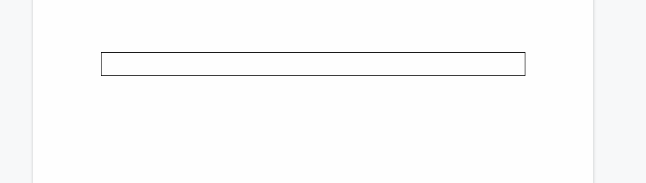
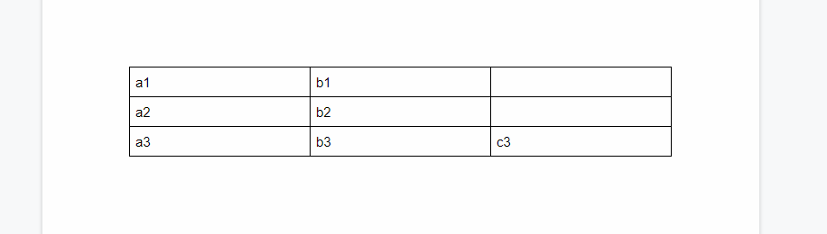
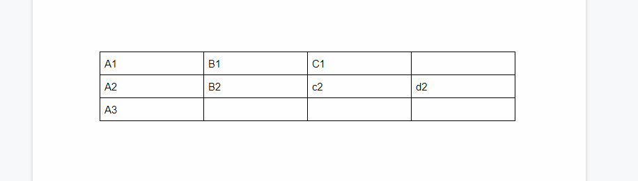
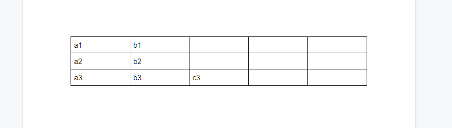
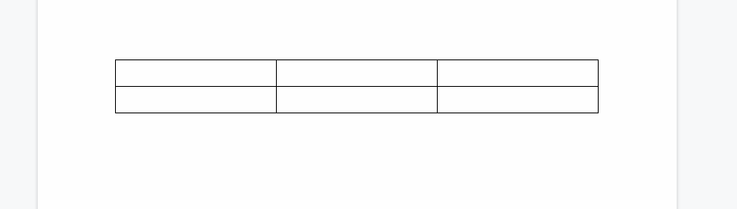
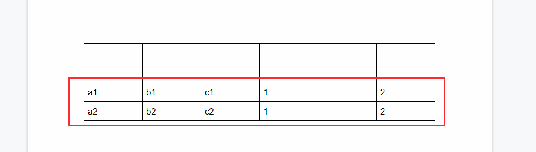

# node-gdoctableapp

[](LICENCE)

<a name="top"></a>

# Overview

This is a Node.js module to manage the tables on Google Document using Google Docs API.

# Description

Google Docs API has been released. When I used this API, I found that it is very difficult for me to manage the tables on Google Document using Google Docs API. Although I checked [the official document](https://developers.google.com/docs/api/how-tos/tables), unfortunately, I thought that it's very difficult for me. So in order to easily manage the tables on Google Document, I created this library.

## Features

- All values can be retrieved from the table on Google Document.
- Values can be put to the table.
- Delete table, rows and columns of the table.
- New table can be created by including values.
- Append rows to the table by including values.

## Languages

I manages the tables on Google Document using several languages. So I created the libraries for 3 languages which are golang, node.js and python. Google Apps Script has Class DocumentApp. So I has never created the GAS library yet.

- [go-gdoctableapp](https://github.com/tanaikech/go-gdoctableapp)
- [node-gdoctableapp](https://github.com/tanaikech/node-gdoctableapp)
- [gdoctableapppy](https://github.com/tanaikech/gdoctableapppy)

# Install

```bash
$ npm install --save-dev gdoctableapp
```

or

```bash
$ npm install --global gdoctableapp
```

You can also see this module at [https://www.npmjs.com/package/gdoctableapp](https://www.npmjs.com/package/gdoctableapp).

# Method

| Method                                            | Explanation                                     |
| :------------------------------------------------ | :---------------------------------------------- |
| [`GetTables()`](#gettables)                       | Get all tables from Document.                   |
| [`GetValues()`](#getvalues)                       | Get values from a table from Document.          |
| [`SetValues()`](#setvalues1)                      | Set values to a table with 2 dimensional array. |
| [`SetValues(`](#setvalues2)                       | Set values to a table with an object.           |
| [`DeleteTable()`](#deletetable)                   | Delete a table.                                 |
| [`DeleteRowsAndColumns()`](#deleterowsandcolumns) | Delete rows and columns of a table.             |
| [`CreateTable()`](createtable)                    | Create new table including sell values.         |
| [`AppendRow()`](#appendrow)                       | Append row to a table by including values.      |

This library uses [googleapis](https://github.com/googleapis/googleapis).

## Response

This library returns the following value.

```javascript
{
    tables: []tables,
    values: []values,
    responseFromAPIs: []responses,
    libraryVersion: version
}
```

- When `GetTables()` is used, you can see the values with `tables`.
- When `GetValues()` is used, you can see the values with `values`.
- When other methods are used and the option of `showAPIResponse` is `true`, you can see the responses from APIs which were used for the method. And also, you can know the number of APIs, which were used for the method, by the length of array of `responseFromAPIs`.

# Usage

About the authorization, please check the section of [Authorization](#authorization). In order to use this library, it is required to confirm that [the Quickstart](https://developers.google.com/docs/api/quickstart/nodejs) works fine.

## Scope

In this library, using the scope of `https://www.googleapis.com/auth/documents` is recommended.

<a name="gettables"></a>

## 1. GetTables

Get all tables from Document. All values, table index and table position are retrieved.

### Sample script

This sample script retrieves all tables from the Google Document of document ID.

```javascript
const resource = {
  auth: auth,
  documentId: documentId
  // showAPIResponse: true // When showAPIResponse is true, the responses from Docs API can be seen.
};
gdoctableapp.GetTables(resource, function(err, res) {
  if (err) {
    console.log(err.errors);
    return;
  }
  console.log(JSON.stringify(res.tables));
});
```

- `documentId`: Document ID.
- `auth`: oAuth2Client for using Docs API. Please check the section of [Authorization](#authorization).
- `showAPIResponse`: When `showAPIResponse: true` is used to `resource`, the responses from Docs API can be seen. The default value is `false`. **This option can be used for all methods.**

<a name="getvalues"></a>

## 2. GetValues

Get values from a table from Document. All values are retrieved.

### Sample script

This sample script retrieves the values from 1st table in Google Document. You can see the retrieved values as `[][]string`. Because when the values are retrieved by Docs API, all values are automatically converted to the string data.

```javascript
const resource = {
  auth: auth,
  documentId: "###",
  tableIndex: 0
};
gdoctableapp.GetValues(resource, function(err, res) {
  if (err) {
    console.log(err.errors);
    return;
  }
  console.log(res.values); // You can see the retrieved values like this.
});
```

- `documentId`: Document ID.
- `tableIndex`: Table index. If you want to use the 3rd table in Google Document. It's 2. The start number of index is 0.
- `auth`: oAuth2Client for using Docs API. Please check the section of [Authorization](#authorization).
- `showAPIResponse`: When `showAPIResponse: true` is used to `resource`, the responses from Docs API can be seen. The default value is `false`.

<a name="setvalues1"></a>

## 3. SetValues 1

There are 2 patterns for putting values to the table. In this section, set values to the table with 2 dimensional array. When the rows and columns of values which are put are over those of the table, this method can automatically expand the rows and columns.

### Sample script

This sample script puts the values to the first table in Google Document.

```javascript
const resource = {
  auth: auth,
  documentId: "###",
  tableIndex: 0,
  values: [["a1", "b1"], ["a2", "b2"], ["a3", "b3", "c3"]]
};
gdoctableapp.SetValues(resource, function(err, res) {
  if (err) {
    console.log(err.errors);
    return;
  }
  console.log(res); // You can see the retrieved responses from Docs API.
});
```

- `documentId`: Document ID.
- `tableIndex`: Table index. If you want to use the 3rd table in Google Document. It's 2. The start number of index is 0.
- `auth`: oAuth2Client for using Docs API. Please check the section of [Authorization](#authorization).
- `values`: `[][]string`
- `showAPIResponse`: When `showAPIResponse: true` is used to `resource`, the responses from Docs API can be seen. The default value is `false`.

### Result

When above script is run, the following result is obtained.

#### From:



#### To:



<a name="setvalues2"></a>

## 4. SetValues 2

There are 2 patterns for putting values to the table. In this section, set values to a table with an object. In this method, you can set the values using the range. When the rows and columns of values which are put are over those of the table, this method can automatically expand the rows and columns.

### Sample script

This script puts the values with the range to the first table in Google Document.

```javascript
const resource = {
  auth: auth,
  documentId: "###",
  tableIndex: 0,
  values: [
    {
      values: [["A1"], ["A2", "B2", "c2", "d2"], ["A3"]],
      range: { startRowIndex: 0, startColumnIndex: 0 }
    },
    {
      values: [["B1", "C1"]],
      range: { startRowIndex: 0, startColumnIndex: 1 }
    }
  ]
};
gdoctableapp.SetValues(resource, function(err, res) {
  if (err) {
    console.log(err.errors);
    return;
  }
  console.log(res); // You can see the retrieved responses from Docs API.
});
```

- `documentId`: Document ID.
- `tableIndex`: Table index. If you want to use the 3rd table in Google Document. It's 2. The start number of index is 0.
- `auth`: oAuth2Client for using Docs API. Please check the section of [Authorization](#authorization).
- `range.startRowIndex` of `values`: Row index of `values[0][0]`.
- `range.startColumnIndex` of `values`: Column index of `values[0][0]`.
- `values` : Values you want to put.
- `showAPIResponse`: When `showAPIResponse: true` is used to `resource`, the responses from Docs API can be seen. The default value is `false`.

For example, when the row, column indexes and values are 1, 2 and "value", respectively, "value" is put to "C3".

### Result

When above script is run, the following result is obtained.

#### From:


#### To:



<a name="deleteuable"></a>

## 5. DeleteTable

### Sample script

This script deletes the first table in Google Document.

```javascript
const resource = {
  auth: auth,
  documentId: "###",
  tableIndex: 0
};
gdoctableapp.DeleteTable(resource, function(err, res) {
  if (err) {
    console.log(err.errors);
    return;
  }
  console.log(res.result); // You can see the retrieved responses from Docs API.
});
```

- `documentId`: Document ID.
- `tableIndex`: Table index. If you want to use the 3rd table in Google Document. It's 2. The start number of index is 0.
- `auth`: oAuth2Client for using Docs API. Please check the section of [Authorization](#authorization).
- `showAPIResponse`: When `showAPIResponse: true` is used to `resource`, the responses from Docs API can be seen. The default value is `false`.

<a name="deleterowsandcolumns"></a>

## 6. DeleteRowsAndColumns

### Sample script

This script deletes rows of indexes of 3, 1 and 2 of the first table in Google Document. And also this script deletes columns of indexes of 2, 1 and 3.

```javascript
const resource = {
  auth: auth,
  documentId: "###",
  tableIndex: 0,
  deleteRows: [3, 1, 2], // Start index is 0.
  deleteColumns: [2, 1, 3] // Start index is 0.
};
gdoctableapp.DeleteRowsAndColumns(resource, function(err, res) {
  if (err) {
    console.log(err.errors);
    return;
  }
  console.log(res); // You can see the retrieved responses from Docs API.
});
```

- `documentId`: Document ID.
- `tableIndex`: Table index. If you want to use the 3rd table in Google Document. It's 2. The start number of index is 0.
- `auth`: oAuth2Client for using Docs API. Please check the section of [Authorization](#authorization).
- `deleteRows` : Indexes of rows you want to delete.
- `deleteColumns` : Indexes of columns you want to delete.
- `showAPIResponse`: When `showAPIResponse: true` is used to `resource`, the responses from Docs API can be seen. The default value is `false`.

<a name="createtable"></a>

## 7. CreateTable

### Sample script

This script creates new table to the top of Google Document, and the cells of the table have values.

```javascript
const resource = {
  auth: auth,
  documentId: "###",
  rows: 3,
  columns: 5,
  createIndex: 1,
  // append: true, // When this is used instead of "Index", new table is created to the end of Document.
  values: [["a1", "b1"], ["a2", "b2"], ["a3", "b3", "c3"]]
};
gdoctableapp.CreateTable(resource, function(err, res) {
  if (err) {
    console.log(err.errors);
    return;
  }
  console.log(res); // You can see the retrieved responses from Docs API.
});
```

- `documentId`: Document ID.
- `auth`: oAuth2Client for using Docs API. Please check the section of [Authorization](#authorization).
- `rows` : Number of rows of new table.
- `columns` : Number of columns of new table.
- `createIndex` : Index of Document for putting new table. For example, `1` is the top of Document.
- `append` : When `append` is `true` instead of `createIndex`, the new table is created to the end of Google Document.
- `values` : If you want to put the values when new table is created, please use this.
- `showAPIResponse`: When `showAPIResponse: true` is used to `resource`, the responses from Docs API can be seen. The default value is `false`.

### Result

When above script is run, the following result is obtained. In this case, the new table is created to the top of Google Document.



<a name="appendrow"></a>

## 8. AppendRow

### Sample script

This sample script appends the values to the first table of Google Document.

```javascript
const resource = {
  auth: auth,
  documentId: "###",
  tableIndex: 0,
  values: [["a1", "b1", "c1", 1, "", 2], ["a2", "b2", "c2", 1, "", 2]]
};
gdoctableapp.AppendRow(resource, function(err, res) {
  if (err) {
    console.log(err.errors);
    return;
  }
  console.log(res); // You can see the retrieved responses from Docs API.
});
```

- `documentId`: Document ID.
- `tableIndex`: Table index. If you want to use the 3rd table in Google Document. It's 2. The start number of index is 0.
- `auth`: oAuth2Client for using Docs API. Please check the section of [Authorization](#authorization).
- `values` : Values you want to append to the existing table.
- `showAPIResponse`: When `showAPIResponse: true` is used to `resource`, the responses from Docs API can be seen. The default value is `false`.

### Result

When above script is run, the following result is obtained. In this case, the values are put to the last row. And you can see that 3 columns are automatically added when the script is run.

#### From:



#### From:



<a name="authorization"></a>

# Authorization

There are 2 patterns for using this library.

## 1. Use OAuth2

Document of OAuth2 is [here](https://developers.google.com/identity/protocols/OAuth2).

### Sample script

In this sample script, the authorization process uses [the Quickstart for Node.js](https://developers.google.com/docs/api/quickstart/nodejs). You can see the detail information at there.

```javascript
const fs = require("fs");
const readline = require("readline");
const { google } = require("googleapis");

// If modifying these scopes, delete token.json.
const SCOPES = ["https://www.googleapis.com/auth/documents"];
// The file token.json stores the user's access and refresh tokens, and is
// created automatically when the authorization flow completes for the first
// time.
const TOKEN_PATH = "token.json";

// Load client secrets from a local file.
fs.readFile("credentials.json", (err, content) => {
  if (err) return console.log("Error loading client secret file:", err);
  // Authorize a client with credentials, then call the Google Drive API.
  authorize(JSON.parse(content), doGdoctableapp);
});

/**
 * Create an OAuth2 client with the given credentials, and then execute the
 * given callback function.
 * @param {Object} credentials The authorization client credentials.
 * @param {function} callback The callback to call with the authorized client.
 */
function authorize(credentials, callback) {
  const { client_secret, client_id, redirect_uris } = credentials.installed;
  const oAuth2Client = new google.auth.OAuth2(
    client_id,
    client_secret,
    redirect_uris[0]
  );

  // Check if we have previously stored a token.
  fs.readFile(TOKEN_PATH, (err, token) => {
    if (err) return getAccessToken(oAuth2Client, callback);
    oAuth2Client.setCredentials(JSON.parse(token));
    callback(oAuth2Client);
  });
}

/**
 * Get and store new token after prompting for user authorization, and then
 * execute the given callback with the authorized OAuth2 client.
 * @param {google.auth.OAuth2} oAuth2Client The OAuth2 client to get token for.
 * @param {getEventsCallback} callback The callback for the authorized client.
 */
function getAccessToken(oAuth2Client, callback) {
  const authUrl = oAuth2Client.generateAuthUrl({
    access_type: "offline",
    scope: SCOPES
  });
  console.log("Authorize this app by visiting this url:", authUrl);
  const rl = readline.createInterface({
    input: process.stdin,
    output: process.stdout
  });
  rl.question("Enter the code from that page here: ", code => {
    rl.close();
    oAuth2Client.getToken(code, (err, token) => {
      if (err) return console.error("Error retrieving access token", err);
      oAuth2Client.setCredentials(token);
      // Store the token to disk for later program executions
      fs.writeFile(TOKEN_PATH, JSON.stringify(token), err => {
        if (err) console.error(err);
        console.log("Token stored to", TOKEN_PATH);
      });
      callback(oAuth2Client);
    });
  });
}

/**
 * Using gdoctableapp.
 */
function doGdoctableapp(auth) {
  const gdoctableapp = require("node-gdoctableapp");

  const resource = {
    auth: auth,
    documentId: "###",
    tableIndex: 0
  };

  gdoctableapp.GetValues(resource, function(err, res) {
    if (err) {
      console.log(err.errors);
      return;
    }
    console.log(res.values); // You can see the retrieved values like this.
  });
}
```

## 2. Use Service account

Document of Service account is [here](https://developers.google.com/identity/protocols/OAuth2ServiceAccount). When you use Service account, please share Google Document with the email of Service account.

### Sample script

```javascript
const { google } = require("googleapis");
const gdoctableapp = require("node-gdoctableapp");
const key = require("### json file including public/private key pair ###");

const jwtClient = new google.auth.JWT(
  key.client_email,
  null,
  key.private_key,
  ["https://www.googleapis.com/auth/documents"],
  null
);

const resource = {
  auth: jwtClient,
  documentId: "###",
  tableIndex: 0
};

gdoctableapp.GetValues(resource, function(err, res) {
  if (err) {
    console.log(err.errors);
    return;
  }
  console.log(res.values); // You can see the retrieved values like this.
});
```

# Limitations

- In the current stage, unfortunately, `tableCellStyle` cannot be modified by Google Docs API. By this, the formats of cells cannot be modified. About this, I have posted as [Feature Request](https://issuetracker.google.com/issues/135136221).

# References:

- Official document: [Inserting or deleting table rows](https://developers.google.com/docs/api/how-tos/tables#inserting_or_deleting_table_rows)
- If you want to know the relationship between the index and startIndex of each cell, you can see it at [here](https://stackoverflow.com/a/56944149).

---

<a name="licence"></a>

# Licence

[MIT](LICENCE)

<a name="author"></a>

# Author

[Tanaike](https://tanaikech.github.io/about/)

If you have any questions and commissions for me, feel free to tell me.

<a name="updatehistory"></a>

# Update History

- v1.0.0 (July 18, 2019)

  1. Initial release.

[TOP](#top)
